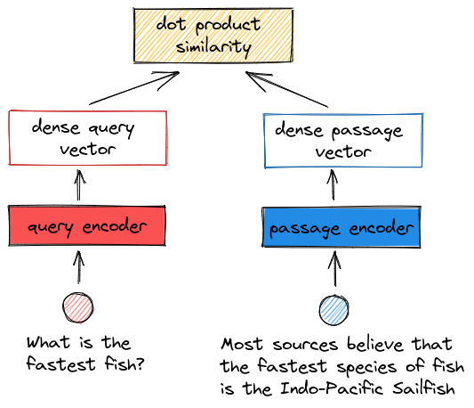

# Dense Passage Retrieval

In 2020 some researchers from Facebook AI Research published a groundbreaking paper: "Dense Passage Retrieval for Open-Domain Question Answering".

The idea of using dense representation to search texts was not new, but DPR outperformed [BM25](sparse-bm25.md) (best sparse retriever) by 9%-19% in terms of top-20 passage retrieval accuracy!

It was time to adopt dense retrieval in real applications...

## The idea
- a passage encoder that maps any text passage to a vector
- a query encoder that represents the query as a vector
- the encoders are two independent BERT networks (base, uncased). As encoder output, we take the representation for the \[CLS\] token (BERT's understanding at the sentence level).
- The encoders are trained jointly to create a vector space where relevant pairs of questions and passages have a smaller distance than the irrelevant pairs.
- The dense vectors that represent the documents are pre-computed and efficiently stored in a FAISS index.
- At run-time, the query vector is computed by the query encoder, then top k passages are retrieved. Most relevant passages are those whose embeddings are nearest to the query vector; they are compared using dot-product.

## Training details
- intelligent building of retrieval datasets from Question Answering datasets
- each training instance contains one question and one relevant passage, along with n irrelevant passages 
- loss function: negative log-likelihood of the correct passage
- **in-batch negatives trick**: take the negative passages for a question from the positive passages of other questions in the same batch. Memory efficient and leads to increase accuracy

## Shortcomings
- Building the index of passages vectors is much more time consuming than building a BM25 index
- In several common implementations, the index resides in memory -> more RAM usage
- The DPR models are language specific and struggle to generalize over out-of-domain datasets 

## Resources
- [Original paper](https://arxiv.labs.arxiv.org/html/2004.04906): worth reading. Very understandable.
- [How to Create an Answer From a Question With DPR](https://towardsdatascience.com/how-to-create-an-answer-from-a-question-with-dpr-d76e29cc5d60): simple blogpost about DPR by James Briggs