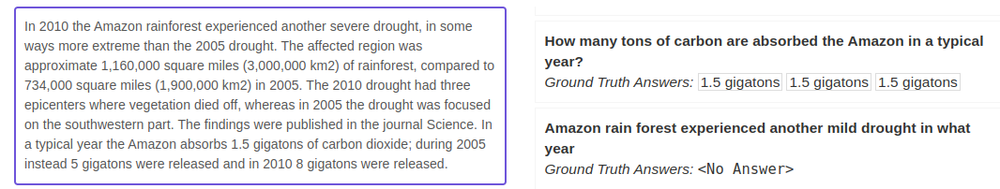

# Extractive Question Answering Evaluation

A Reader 📖 is a model that performs **Extractive Question Answering**: given a question and a context, the model selects the best span from the context, which answers the question.

**How can we objectively evaluate such a model?**

## The evaluation dataset
To compute the performance 📈 of our model, we first need an **evaluation dataset**.

The most common format for Question Answering data is the Stanford Question Answering Dataset (SQuAD) format.
Each example consists of the context, the question, and some correct ground-truth answers (up to 5). Starting with SQuAD 2.0, you can include questions that can't be answered based on context.

## Metrics: Exact Match (EM)
Exact Match is a very simple but strict metric.

For each example in the Evaluation Dataset, EM equals 1 if the predicted answer exactly matches (one of) the true answer(s). Otherwise, EM is 0.

For example, for the annotated question answer pair “How many nations contain "Amazonas" in their names?" + "four”, even a predicted answer like “four nations” would give EM=0.

## Metrics: F1
The F1 score is less stringent and quantifies the overlap of words between the predicted answer and the true one.

Going deeper, F1 is the harmonic mean of precision and recall.
In this scope, precision is computed as the ratio of the number of overlapping tokens to the number of predicted answer tokens. Recall is the ratio of the number of overlapping tokens to the number of true answer tokens.

So in the above case, F1=~0.7

## Metrics: Semantic Answer Similarity (SAS)
EM and F1 rely on the lexical overlap and cannot capture the meaning of the predicted and true answer.
In 2021, Deepset researchers 🧑‍💻 published the paper "Semantic Answer Similarity for Evaluating Question Answering Models".

SAS uses a cross-encoder to compare the predicted and the true answer.
A cross-encoder is a transformer model that produces an output value between 0 and 1, indicating the similarity of the input pair.
In the paper, they find that SAS correlates much better with human judgment than traditional lexical similarity metrics.

*An example:*
- Question: Where does the last name Andersen originate from?
- True Answer: Danish-Norwegian patronymic surname meaning ”son of Anders”
- Predicted Answer: Denmark

EM=0
F1=0
SAS=0.47

## Resources
- [F1 score in NLP span-based Question Answering task](https://kierszbaumsamuel.medium.com/f1-score-in-nlp-span-based-qa-task-5b115a5e7d41): simple and deep blogpost by Samuel Kierszbaum
- [Semantic Answer Similarity - The Smarter Metric to Score Question Answering Predictions](https://www.deepset.ai/blog/semantic-answer-similarity-to-evaluate-qa): deepset blog post introducing SAS