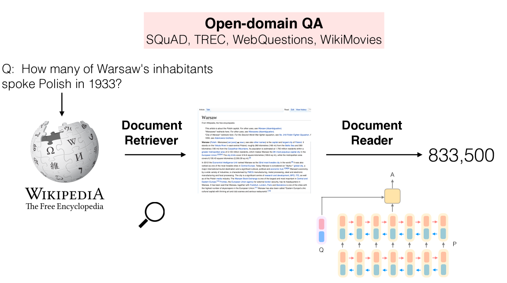

# Combining document retrieval and machine comprehension for Question Answering

A Question Answering system expects a question asked in a natural language and returns an answer.
In open-domain open-book **extractive** QA 📖, the relevant information is retrieved from a knowledge repository and processed to extract an answer.

**How can we implement such a system?**

## Machine Reading at scale
In 2017, Danqi Chen et al. published the seminal paper "Reading Wikipedia to Answer Open-Domain Questions", introducing the idea of Machine Reading at scale.

*(Image from the original paper)*

- the only source of knowledge is made up of unstructured text articles taken from Wikipedia.
- first, they use a Document Retriever 🔎 module for finding the 5 most relevant articles for the user question.
This search component is a non-machine learning sparse retriever, based on bigram hashing and TF-IDF matching.
- the information collected by the retriever is processed by the Document Reader, a machine comprehension model that extracts answers from the documents.
The Document Reader is a multi-layer recurrent neural network model, trained on the SQuAD dataset and other Question Answering datasets.

- Results: Both modules taken in isolation are highly competitive against their existing counterparts.
The system as a whole is effective for the challenging task of Open-Domain Question Answering!

## Retriever + Reader today

The idea of Machine Reading at scale is still valid, effective, and widely adopted.
However, nowadays the original components are usually replaced with better performing nodes.

- the retriever can be still based on the classic sparse approaches (BM25), but can also consist of a modern Dense retriever, using e.g. SentenceTransformers embeddings.
- usually, the reader is a Transformer model, fine-tuned on question answering datasets.

The reader performs a deep and complex analysis of textual passages, to extract the answers.
So it can be slow and you can't run it on the whole document collection.
The retriever acts as a filter, and provides the reader with only the most relevant documents, making the entire system usable and performing.

The deepset Haystack framework shows a great example of a Retriever + Reader pipeline.
You can run it in just a few lines of code!

## Resources
- [Reading Wikipedia to Answer Open-Domain Questions](https://arxiv.org/abs/1704.00051): Original paper
- [Haystack Tutorial 1: Build Your First Question Answering System](https://haystack.deepset.ai/tutorials/01_basic_qa_pipeline): simple tutorial on creating a Retriever + Reader pipeline in Haystack
- [How to Build an Open-Domain Question Answering System?](https://lilianweng.github.io/posts/2020-10-29-odqa/): very deep and accurate blogpost by Lilian Weng
