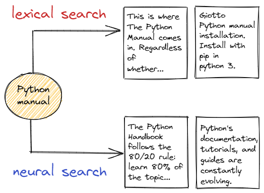

# What is Neural Search? 🔎

Classical search engines use **lexical search**: the user's query is compared with documents through keyword matching.
Documents containing the query words are considered relevant. If you search for "manual", you don't find documents containing "handbook" or "guide".

In **Neural Search**, a deep learning model is used to represent both the documents and the query as **vectors**.
At retrieval time, the query vector is compared against the document vectors to provide the most pertinent documents.

- The vectors can also capture **semantic** information and other information related to the context in which a given word appears.
- Neural Search opens the door to **Multimodal Search**: texts and images 🖼️ can be represented as vectors in the same space 
and thus can be mutually searchable.

Clearly, all that glitters is not gold and both approaches have their strengths and weaknesses.

## Resources
- [Understanding Semantic Search](https://www.deepset.ai/blog/understanding-semantic-search): Great and simple blogpost by Deepset