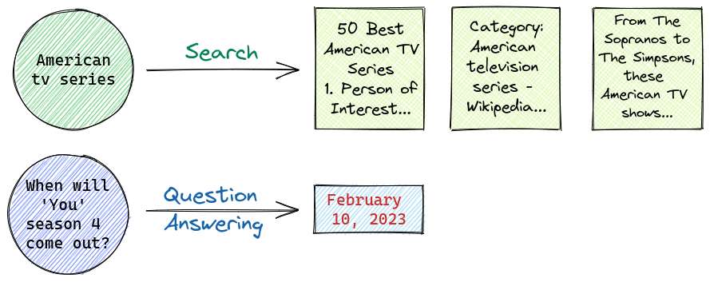

# What is Question Answering❓

When you perform a search 🔎, your query is matched against a collection of documents. 
Hopefully, the result will be the most relevant documents.

Instead, a Question Answering system expects a question asked in a natural language and returns an answer.

QA systems can use different technical approaches: they can be rule-based, machine learning-based, or hybrid.

The knowledge used by Question Answering systems can be stored in different forms: SQL databases, search platforms, vector databases, knowledge graphs...
In some machine learning QA systems, the knowledge is included in the machine learning model.

## Classification
**Closed-domain QA** systems focus on a specific domain and can rely on domain-specific knowledge frequently formalized in ontologies.
In contrast, **open-domain QA** systems expect questions about a wide variety of topics, are less specific, and typically deal with larger amounts of data.

Within the ODQA category, we can distinguish between open-book QA and closed-book QA.

In **open-book QA** 📖, the relevant information is retrieved from a knowledge repository. Then, this information is processed to extract or generate an answer.

In **closed-book QA** 📕, a text generation model can only rely on its internal knowledge to answer a question.

## Resources
- [An Introduction to Open Domain Question-Answering](https://www.pinecone.io/learn/question-answering/): Pinecone blogpost with a detailed and practical overview on Question Answering.
- [Understanding Semantic Search](https://www.deepset.ai/blog/understanding-semantic-search): Deepset blogpost with a timely overview of the landscape and jargon of semantic search and question answering systems.