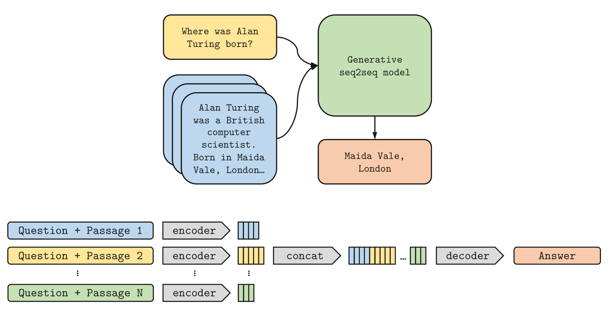

# Retrieval-based Answer Generation

Differently from [Extractive systems](machine-reading-at-scale.md), **Generative/Abstractive Question Answering** systems create answers to questions, based on some knowledge.
The answers generated by abstractive systems can aggregate information contained in multiple original passages and are human-like.

## Generative closed-book 📕 systems (ChatGPT-like)

Today everybody knows and talks about ChatGPT.
If we look at it from the Question Answering point of view, it is a **closed-book** system: it relies on its internal knowledge.
This knowledge is also known as "parametric memory": it is stored in the model weights and is accumulated during training.

When used in isolation, abstractive closed-book QA systems have some serious limits:
❌ their knowledge is generic and is not easily updated over time
❌ they may produce "hallucinations"

## Retriever + Generator

To overcome the drawbacks of generative closed-book solutions, several systems have been developed that share a similar idea:
* use a Retriever 🔎 to collect text passages that are relevant to the user question
* use the non-parametric knowledge stored in text passages to condition the Answer Generation

In the last years, various systems combining the two components have been proposed.
For example, I cite ORQA (Google), REALM (Google), RAG (Meta), FiD (Meta), RETRO (Deepmind).
Probably the most popular one is Retrieval-Augmented Generation (RAG), proposed by Patrick Lewis et al. in 2020 and returned to the limelight in recent months.

## Fusion-in-Decoder (FiD)

I want to mention this system, which is not so famous, but simple and effective.
It has been introduced by Gautier Izacard and Edouard Grave (Meta Research) in 2021.

- for **Retrieval** from Wikipedia, the authors took two methods into consideration: BM25 (sparse retrieval) and Dense Passage Retrieval. *Since the retriever is not trained, FiD is potentially compatible with any retrieval system.*

- the **generative** model is based on a sequence-to-sequence network, pretrained on unsupervised data, such as T5 (encoder-decoder architecture). Each retrieved passage and its title are concatenated with the question, and processed independently from other passages by the encoder. Then the decoder performs attention over the concatenation of the resulting representations of all the retrieved passages (*Fusion-in-Decoder*).
  
**Experiments and results:**
- FiD system has been trained and evaluated on 3 different QA datasets
- while conceptually simple, trained models are competitive or better than closed book approaches and result in much smaller sizes
- important performance gains are attained by using retrieval knowledge and scaling to large number of jointly processed passages

## A lesson to take home
- (Large) Language Models 🧠 have strong text comprehension/generation skills 
- Their knowledge is generic and is not easily updated over time
- When building NLP applications, we can combine LM with 🔎 Retrieval systems to provide new/specific knowledge and make them answer factually!

  
## Resources
https://www.youtube.com/watch?v=Dm5sfALoL1Y rag (to use in #nsp)
https://jalammar.github.io/illustrated-retrieval-transformer/
rag original paper https://arxiv.org/abs/2005.11401
Connor shorten video https://youtu.be/dzChvuZI6D4
https://www.linkedin.com/pulse/beyond-confident-talking-parrot-chatgpt-enjun-choong/ great!!!
fastrag (implements fid)!
