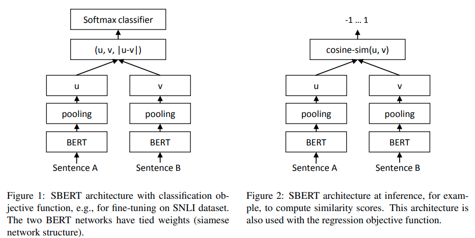

# SentenceTransformers for Dense Retrieval

We have already introduced Dense Retrievers, which take into account profound semantic traits of indexed documents to return the passages most relevant to the user's query.

Nowadays, [Dense Passage Retrieval](dpr.md) is not the only technique in the Dense Retrieval world nor the most popular one.

In 2019, Nils Reimers and Iryna Gurevych published the paper "Sentence-BERT: Sentence Embeddings using Siamese BERT-Networks". They also released the SentenceTransformers python library...
Let's find out what problem they solved and how this relates to Dense Retrieval.

## Limits of BERT for sentence embeddings
- BERT can compare two sentences using a **cross-encoder**. Two sentences are passed to the transformer network that produces an output value between 0 and 1, indicating the similarity of the input sentence pair.
- This approach takes a long time ⏳ and is unsuitable for practical situations. Finding which of Quora's over 40 million questions is the most similar to a new question would take over 50 hours on a modern GPU.
- Some common practices for extracting sentence-level embeddings from BERT are to average the BERT output layer or take the representation for the \[CLS\] token. These common approaches produce pretty poor sentence embeddings, often worse than averaging GloVe embeddings.

## Sentence-BERT
The paper is quite complex, but let's try to bring home the most important concepts 👨‍🏫:
- start from pre-trained BERT and RoBERTa models
- add a pooling operation to the output of the original models to derive a fixed sized sentence embedding
- to fine-tune the pre-trained models, create a siamese architecture: we can think of this as having two identical models in parallel sharing the same network weights.
- Depending on the training data, different structures and objective functions are adopted.
- During fine-tuning, the weights are updated so that the produced sentence embeddings are semantically meaningful and can be compared with cosine-similarity.
- The most prominent fine-tuning was performed on SNLI+MNLI (Natural Language Inference datasets) with a 3-way softmax-classifier objective function.

 (Image from the original paper)

- **Results**:
  - on various common benchmarks, SBERT achieves a significant improvement over state-of-the-art sentence embeddings methods.
  - SBERT is computationally efficient, especially using the GPU. For example, the above Quora task can be accomplished in milliseconds instead of 50 hours.
  - SBERT can be easily adapted to specific tasks.

## Retrieval

Currently, SentenceTransformers library is very popular and up to date.
It offers several pre-trained models that have been fine-tuned for semantic search and ranking tasks, using for example the large MS MARCO corpus.
I don't know of explicit comparisons between DPR and SBERT for retrieval, but it is widely believed that the latter performs better, as well as being more widespread and more practical because it is based on a single model instead of two.

## Resources
- [Sentence-BERT: Sentence Embeddings using Siamese BERT-Networks](https://arxiv.labs.arxiv.org/html/1908.10084): Original paper
- [SentenceTransformers library](https://www.sbert.net/)
- [Sentence Transformers: Meanings in Disguise](https://www.pinecone.io/learn/sentence-embeddings/): Pinecone blogpost that takes an in-depth look at the SBERT paper
- [The Art of Pooling Embeddings](https://blog.ml6.eu/the-art-of-pooling-embeddings-c56575114cf8): great blogpost by Mathias Leys explaining sentence embeddings and the need for pooling