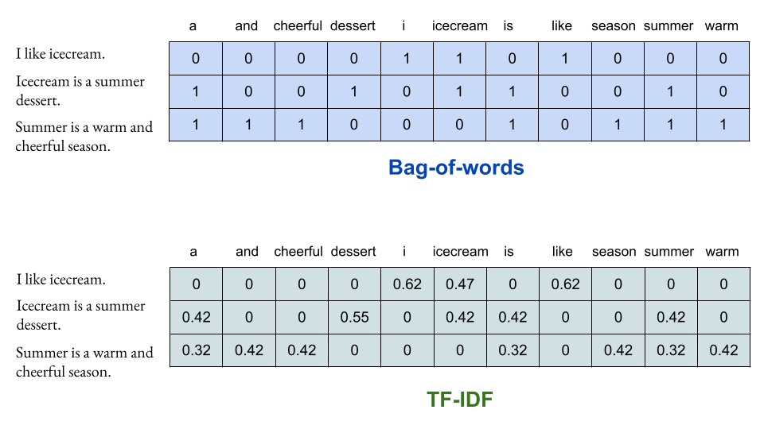

# Sparse retrieval: Bag-of-words, TF-IDF

When it comes to search engines, **retrieval** is the process of returning the most relevant documents, based on a specific user query.

Classical lexical search engines are based on **sparse representations for retrieval**.

Let's start with the simplest representation: **Bag-of-words**. 👜
- Build a vocabulary composed of all the words in your corpus (=collection of documents)
- For each document, construct a vector with the same length as the vocabulary. Put a 1 for each word that appears in the document and a 0 for each missing word.
- Done!

These types of representations are called sparse because in everyday applications the vocabulary is very large, so each document vector contains many 0s and very few 1s.

BOW does not take word order into account. Other than that, it is not very expressive because every word has only two possible weights (0 or 1). So it is practically not used to create search engines.

An evolution of BOW is called Term Frequency - Inverse Document Frequency (**TF-IDF**).
- the weight of a word increases the more the word is repeated in the document
- the weight is lower the more the term is present within the corpus (think of articles, conjunctions...)

While simple, TF-IDF is very popular and (spoiler 😉) is the basis of BM25, the most widely used algorithm for sparse retrieval.

## Resources
- [Demystify TF-IDF in Indexing and Ranking](https://ted-mei.medium.com/demystify-tf-idf-in-indexing-and-ranking-5c3ae88c3fa0): Ted Mei's blogpost, explaining the TF-IDF algorithm and proposing a simple implementation